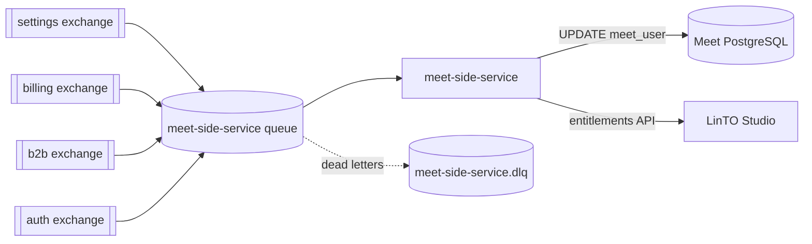

# Architecture

`meet-side-service` is the side service of Meet in Twake Workplace, following [ADR 068](https://github.com/linagora/twake-workplace-private/blob/69002475b5beb570de816163d3350e41ec3dd4df/documentation/docs/adrs/adr-068.md). It consumes Twake events from RabbitMQ and applies them where Meet reads them:

- A user's language and timezone, saved in common-settings, go to Meet's database.
- A user's or a domain's plan goes to LinTO Studio, so Meet can gate transcription and recording. This part is off unless `ENTITLEMENTS_ENABLED=true`. [ADR 061](https://github.com/linagora/twake-workplace-private/pull/1745) has the reasoning.

It publishes no event and has no database of its own. Meet itself is unchanged.

- [Events](events.md) lists every event consumed and what it does.
- [Product](product.md) lists every column read or written in Meet's database and every LinTO Studio call.
- [Deploy](deploy.md) lists every setting, the permissions, the probes and metrics, and how to run it locally.

[Development](development.md#project-layout) maps the code.

## Why Meet's database directly

Meet has no API to write another user's settings: its user endpoint only lets a user update their own record ([`IsSelf`](https://github.com/linto-ai/meet/blob/c1c3bd0eed7ec422417cd667a910046a6a9b507f/src/backend/core/api/viewsets.py#L207)). Adding one, or a RabbitMQ consumer inside Meet's backend, means changing Meet. Writing two columns of `meet_user` does not.

The cost is that the service depends on Meet's table. That is kept small:

- Its database role can read and write only the columns it uses, so a mistake fails loudly instead of touching anything else.
- The integration tests run against the table as the deployed Meet version creates it, see [following a Meet upgrade](development.md#following-a-meet-upgrade).

## One queue

Every event reaches the service through one quorum queue, `meet-side-service`, bound to each routing key it handles. The queue dead letters to its own exchange, `meet-side-service.dlx`, into `meet-side-service.dlq`, and caps broker redeliveries at 10. The exchanges it binds to belong to their publishers: the service checks that they exist and never declares them.

A dead letter moved back into the queue arrives on the default exchange. The router then reads its origin from the `x-death` header.

## Outcomes and retries

Each event ends in one outcome, counted in `mss_events_total`:

- `handled`: applied, or nothing to apply. Acked.
- `stale`: Meet or LinTO already holds newer state, so nothing changes. Acked.
- `dropped`: the event is malformed. Acked and logged.
- `dead_lettered`: refused for good, out of retries, or not JSON. Moved to `meet-side-service.dlq`.
- `unrouted`: no handler for its exchange and routing key. Dead lettered.

A failure that may pass, such as a timeout or a connection refused by Postgres or LinTO, is retried by `@linagora/rabbitmq-client`. It waits `RABBITMQ_RETRY_DELAY` before the second attempt, doubles the wait up to `RABBITMQ_MAX_RETRY_DELAY`, and dead letters after `RABBITMQ_MAX_RETRIES` attempts. With the defaults that covers about 14 minutes of outage. A refusal that will not pass skips the retries. [Events](events.md) says which failures are which.

While entitlements are on, events are handled one at a time, so an outage of Postgres or LinTO also holds back the events bound for the other one, for as long as the retries last.

## Ordering

Settings events can be handled in any order, by any number of consumers. Each write is guarded by Meet's own `updated_at`, see [product](product.md#meet-database).

Entitlement events rely on LinTO's order guard, which compares the `updatedAt` the service sends. A LinTO `DELETE` carries none, so entitlements still need at most one consumer, see [replicas](deploy.md#replicas).

## Upgrading from one queue per event

Releases up to 0.2.0 consumed from one queue per event (`meet.user_settings` and `meet.<routing key>`). On startup the service unbinds each one it finds, hands what it holds to the same handlers, and deletes it once empty. [Deploy](deploy.md#upgrading-from-020) covers the rollout.
